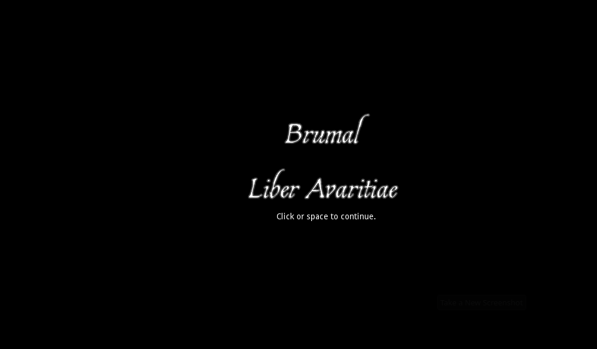

# Brumal

A game of greed and horror in winter.

## The Story

After stealing the Liber Avaritiae, you've killed your companions to keep all the riches it will lead to to yourself. You've made your way to an isolated cabin prepared for use of the tome...

### The Game

Brumal is a game created for the Themed Horror Game Jam #3 on itch.io. It is a first-person, low-poly horror adventure written using the Godot Engine. 

[itch.io listing](https://jpspadaro.itch.io/brumal)
[dev log](https://jpspadaro.itch.io/brumal/devlog)
